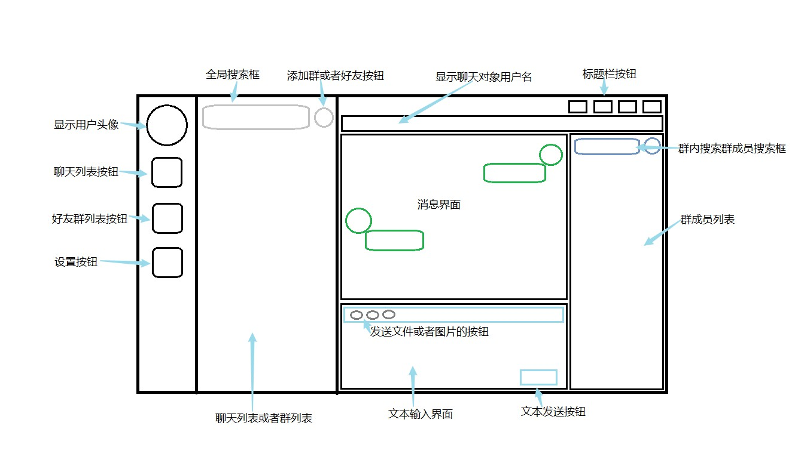
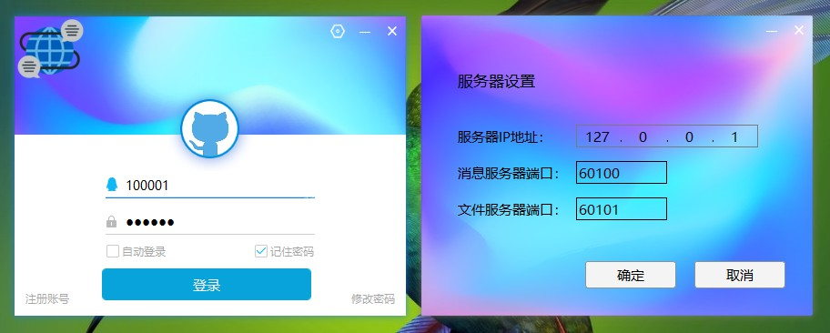
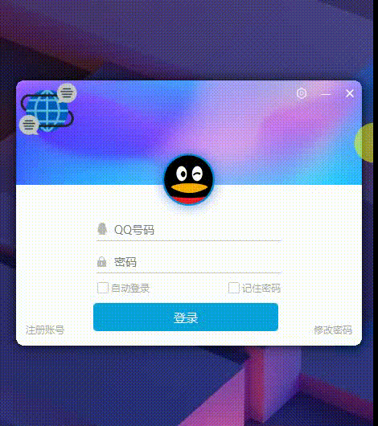
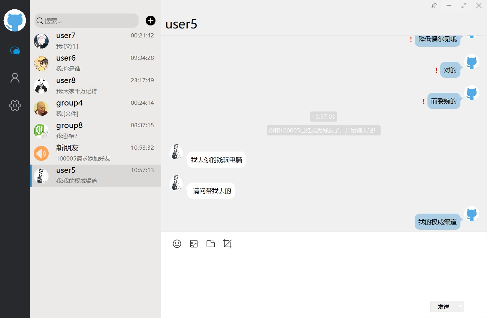
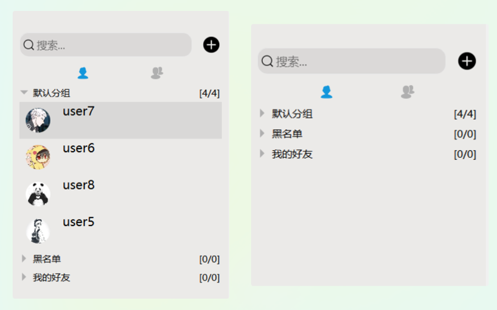
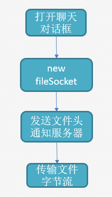
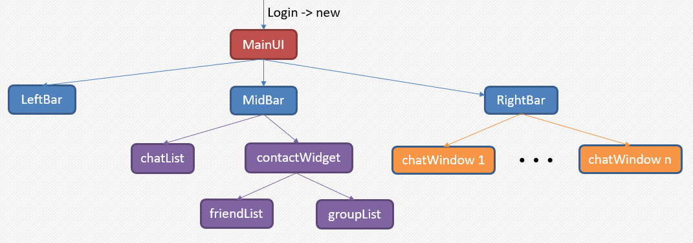

# QQ
融合QQ和微信界面风格的聊天软件

这是本人用 C++ 和 Qt 实现的一款聊天软件，整个软件包含服务器端和客户端，代码总行数大约2W行。

## 目前实现的功能包括：
- 注册
- 登陆
- 修改登录密码
- 搜索
- 添加好友，删除好友
- 好友和群分组管理
- 添加群，退出群，创建群
- 私聊和群聊，支持以下消息类型
  - 普通文本消息
  - 图片
  - 文件
- 本地历史消息记录和加载

由于时间有限，目前只能说是实现了非常基本的一些功能，后续有时间可能会加以完善。

## 总体架构
整个程序基于C/S模型实现，程序运行过程中有一台服务器和多台客户端。客户端之间不能直接通信，
所有的消息都必须先经过服务器，服务器对消息进行解析，根据消息类型做出相应的处理。服务器在整个过程中充当着中转站的角色。程序整体架构如下：


## UI设计
- 客户端整体UI设计图如下：



- 登录界面模仿腾讯QQ实现，背景是通过贴图实现的。


- 登录界面点击设置按钮也会有一个旋转的效果，如下：



- 聊天列表界面模仿微信界面，整体基于QListWidget实现，内部的每个聊天格子基于Qwidget重绘实现，能够显示好友，群聊天消息，点击可以进入右边的聊天界面


- 联系人界面模仿QQ界面，基于QStackedWidget类和QListWidget类实现，能够实现好友联系人列表和群列表之间的切换，能够实现分组显示，同时能够折叠和展开


- 聊天框界面模仿微信界面，基于QListWidget实现，能够容纳多种消息类型，并且具有很强的拓展性，能够容纳后续添加的新的类型的消息。目前能显示文字，图片，文件，系统消息等。


## 数据库设计
- 为了减少访问服务器的频率，需要在本地缓存一些信息，客户端也需要设计数据库，目前客户端只设计了4张表

| 历史消息 | 我的好友 | 好友分组 | 我的群 |
| ---- | ---- | ---- | ---- |
| ![][database1]|![][database2]|![][database3]|![][database4] |

- 服务器端的数据库记录着所有用户和群的信息，用户之间的好友关系，用户和群的所属关系，用户发送的消息，用户发送的文件等

| 用户信息 | 好友关系 | 加群信息 |
| :------------: | :------------: | :-----------: |
| ![][database5]|![][database7]|![][database9] |


| 群组信息 | 发送文件 | 未读消息 |
| :------------: | :------------: | :-----------: |
| ![][database6]|![][database8]|![][database10] |


## 消息封装
整个软件运行过程中会存在多种消息类型，比如登陆，注册，修改密码，获取群成员，加好友，加群，删好友，退群等等。必须使用一种通用的消息封装格式，使得服务器能够快速解析出各种消息并且进行相应处理，同时还要有足够的可拓展性，以便以后添加新的功能。

为此，服务器和客户端需要同时定义一组枚举变量，代表不同的消息类型，目前程序支持的消息类型如下所示：
```c++
typedef enum {
    Unknow,
    Register            = 0x10,     // 用户注册
    Login,                          // 用户登录
    Logout,                         // 用户注销
    LoginRepeat,                    // 重复登录

    UserOnLine          = 0x15,     // 用户上线通知
    UserOffLine,                    // 用户下线通知
    UpdateHeadPic,                  // 用户更新头像

    AddFriend           = 0x20,     // 添加好友
    AddGroup,                       // 添加群组

    AddFriendRequist,               // 添加好友确认通知
    AddGroupRequist,                // 添加群组确认通知

    CreateGroup         = 0x25,     // 创建群组

    GetMyFriends        = 0x30,     // 上线获取我的好友的状态
    GetMyGroups,                    // 获取我的群组信息
    GetGroupMembers,                // 获取群组成员

    RefreshFriends      = 0x35,     // 刷新好友状态
    RefreshGroups,                  // 刷新群组成员状态

    SendMsg             = 0x40,     // 发送消息
    SendGroupMsg,                   // 发送群组消息
    SendFile,                       // 发送文件
    SendPicture,                    // 发送图片
    SendFace,                       // 发送表情

    ChangePasswd        = 0x50,     // 修改密码

    DeleteFriend        = 0x55,     // 删除好友
    DeleteGroup,                    // 退出群组

    SendFileOk          = 0x60,     // 文件发送完成状态

    GetFile             = 0x65,     // 获取文件（到服务器下载文件）
    GetPicture,                     // 图片下载

    MsgReceived         = 0x70,     //服务器收到了该条消息，向用户返回确认信息

    FindFriend          = 0x75,     //查找好友或者群

    GetOfflineMsg       = 0x80      //获取离线消息
} E_MSG_TYPE;

```

同时客户端采用 Json 封装所需要发送的消息，封装格式如下：
```c++
// 构建 Json 对象
QJsonObject json;
json.insert("from", ID);
json.insert("type", type);
json.insert("data", dataVal);

// 构建 Json 文档
QJsonDocument document;
document.setObject(json);
tcpSocket->write(document.toJson(QJsonDocument::Indented));
```

## 文件传输
文件传输耗时较长，不能当作普通的消息处理，必须单独用一个线程去处理，否则一定有文件要发送或者有文件要接收，整个程序就会阻塞，无法进行其他操作。由于存在多个聊天对话框同时发送文件的使用场景，故需要为每一个聊天窗口单独分配一个发送文件的socket类，同时考虑到这样做可能造成过多的内存占用，所以只有当用户点击进入聊天对话框时才开始分配这个资源。

文件传输采用Tcp协议进行，因为要保证文件不会丢失任何一个字节或者任何一位错乱。

文件发送过程如下：



文件发送格式如下：
| 文件总大小 | 文件名大小 | 时间戳 | 文件名 | 文件字节流 |
| :------: | :------: | :------: | :-----------: | :-----------: |
| 64bit | 64bit | 64bit | 文件名字符串所占空间 | 文件本身所占空间 |


## 类消息传递
由于整个界面的类结构比较复杂，事实上整个界面是经过多层堆叠形成的效果，所以存在着很多变量之间不能直接访问的问题，但是程序运行期间很多类之间又必须需要通信，比如整个客户端程序只存在一个发送普通消息的socket类，在登陆界面初始化该类，并且用于发送登陆消息，等登陆结束后，需要把这个类传递给主界面类，然后主界面类里面又包含几个子类，主界面收到消息需要交给子类处理，子类也有消息传递给主界面类进行发送，故需要使用一种消息传递机制来达成这种通信目的。Qt里面的信号和槽机制完美的解决了这个问题，而且是基于多线程实现了，不会出现冲突问题。Qt中信号和槽使用形式如下：

```connect(sender, signal, receiver, slot);```

这个函数的意思是sender发出的signal信号可以被receiver接收并且转到slot函数中处理。


主界面的类层次关系如下，它们之间的消息传递都是基于上面的信号和槽机制实现



## 服务器消息解析
上面讲过，客户端发给服务器的各种消息都是用Json封装过的。服务器在收到消息后，首先提取其中的“消息类型”字段，通过判断消息类型来分别来调用不同的函数处理。具体过程如下：

```c++
void ClientSocket::sltReadyRead()
{
    // 读取socket数据
    QByteArray reply = tcpSocket->readAll();
    QJsonParseError jsonError;
    // 转化为 JSON 文档
    QJsonDocument doucment = QJsonDocument::fromJson(reply, &jsonError);
    // 解析未发生错误
    if (!doucment.isNull() && (jsonError.error == QJsonParseError::NoError)) {
        // JSON 文档为对象
        if (doucment.isObject()) {
            // 转化为对象
            QJsonObject jsonObj = doucment.object();
            int msgType = jsonObj.value("type").toInt();//提取消息类型并进行相应的消息解析
            int senderID = jsonObj.value("from").toInt();
            QJsonValue dataVal = jsonObj.value("data");

            //            qDebug() << "cur time:" << QDateTime::currentDateTime().
            //                        toString("yyyy-MM-dd  hh:mm:ss.zzz");
            qDebug() << "<- "  << "服务器收到一条来自于" <<  senderID
                     << "的消息，消息内容为:" << endl
                     << jsonObj << endl;

            switch (msgType) {
            case Register:
            {
                parseReister(dataVal);
            }
                break;
            case Login:
            {
                parseLogin(dataVal);
            }
                break;
            case UserOnLine:
            {
                parseUserOnline(dataVal);
            }
                break;
            case Logout:
            {
                parseLogout(dataVal);
                Q_EMIT signalDisConnected();
                tcpSocket->abort();
            }
                break;
            case UpdateHeadPic:
            {
                parseUpdateUserHead(dataVal);
            }
                break;
            case AddFriend:
            {
                parseAddFriend(dataVal);
            }
                break;
            case AddGroup:
            {
                parseAddGroup(dataVal);
            }
                break;
            case CreateGroup:
            {
                parseCreateGroup(dataVal);
            }
                break;
            case GetMyFriends:
            {
                parseGetMyFriend(dataVal);
            }
                break;
            case GetMyGroups:
            {
                parseGetMyGroups(dataVal);
            }
                break;
            case GetGroupMembers:
            {
                parseGetGroupMembers(dataVal);
            }
                break;

            case RefreshFriends:
            {
                parseRefreshFriend(dataVal);
            }
                break;
            case RefreshGroups:
            {
                parseRefreshGroups(dataVal);
            }
                break;

            case SendMsg://私发消息
            case SendFile:
            case SendPicture:
            {
                parseFriendMessages(reply);
            }
                break;
            case SendGroupMsg://群发消息
            {
                parseGroupMessages(reply);
            }
                break;
            case SendFace:
            {
                //parseGroupMessages(reply);
            }
                break;
            case SendFileOk:
            {

            }
                break;
            case GetFile:
            case GetPicture:
            {
                Q_EMIT signalDownloadFile(dataVal);
            }
                break;
            case ChangePasswd:
            {
                parseChangePwd(dataVal);
            }
                break;
            case FindFriend:
            {
                parseFindFriend(dataVal);
            }
                break;
            case AddFriendRequist:
            {
                parseAddFriendReply(dataVal);
            }
                break;
            case AddGroupRequist:
            {
                parseAddGroupReply(dataVal);
            }
                break;
            case DeleteFriend:
            {
                parseDeleteFriend(dataVal);
            }
                break;
            case DeleteGroup:
            {
                parseDeleteGroup(dataVal);
            }
                break;
            case GetOfflineMsg:
            {
                parseGetOfflineMsg(dataVal);
            }
                break;
            default:
                break;
            }
        }
    }
}
```

其中不同的函数负责处理不同类型的消息。


[database1]: ./Screenshots/database1.png
[database2]: ./Screenshots/database2.png
[database3]: ./Screenshots/database3.png
[database4]: ./Screenshots/database4.png
[database5]: ./Screenshots/database5.png
[database6]: ./Screenshots/database6.png
[database7]: ./Screenshots/database7.png
[database8]: ./Screenshots/database8.png
[database9]: ./Screenshots/database9.png
[database10]: ./Screenshots/database10.png
